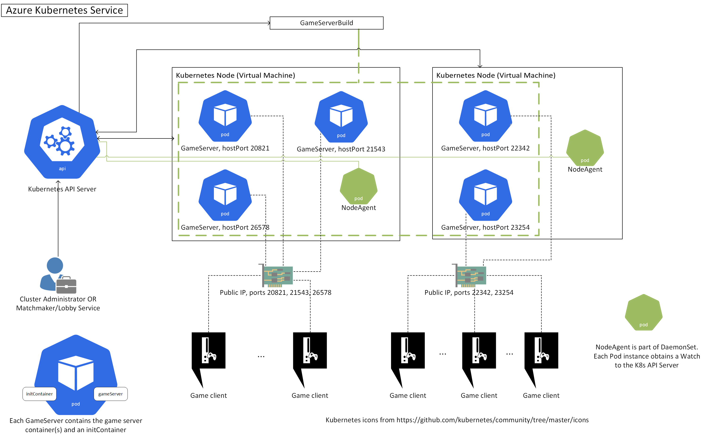

# Architecture

This document describes the architecture of Thundernetes as well as various design notes that are relevant to its implementation.

## Goal

End goal is to create a utility that will allow game developers to host their Game Server SDK ([gsdk](https://github.com/playfab/gsdk)) enabled Windows or Linux game servers on a Kubernetes cluster, either on-premise or on a public cloud provider. This utility will enable GameServer auto-scaling and GameServer allocations. With the term "allocation" we mean that pre-warmed game servers (we call this state "StandingBy") can transition into an "Active" state so that players (game clients) can connect to them. On a potential scale down, Thundernetes will never take down Active game servers or Nodes that have Active game servers running.

We are extending Kubernetes by creating an [operator](https://kubernetes.io/docs/concepts/extend-kubernetes/operator/). This involves creating a custom [controller](https://kubernetes.io/docs/concepts/architecture/controller/) and some [Custom Resource Definitions (CRDs)](https://kubernetes.io/docs/concepts/extend-kubernetes/api-extension/custom-resources/) that describe various game server related entities to Kubernetes. We are using the open source tool [kubebuilder](https://github.com/kubernetes-sigs/kubebuilder) to scaffold our operator files which use [controller-runtime](https://github.com/kubernetes-sigs/controller-runtime).

Specifically, we have three core entities in our project, which are represented by the respective CRDs:

- **GameServerBuild** ([YAML](https://github.com/playfab/thundernetes/tree/main/pkg/operator/config/crd/bases/mps.playfab.com_gameserverbuilds.yaml), [Go](https://github.com/playfab/thundernetes/tree/main/pkg/operator/api/v1alpha1/gameserverbuild_types.go)): this represents a collection of GameServers that will run the same Pod template and can be scaled in/out within the Build (i.e. add or remove instances of them). GameServers that are members of the same GameServerBuild share the same details in their execution environment, e.g. all of them could launch the same multiplayer map or the same type of game. So, you could have one GameServerBuild for a "Capture the flag" mode of your game and another GameServerBuild for a "Conquest" mode. Or, one GameServerBuild for players playing on map "X" and another GameServerBuild for players playing on map "Y". You can, however, modify how each GameServer operates via BuildMetadata (configured on the GameServerBuild) or via environment variables.
- **GameServer** ([YAML](https://github.com/playfab/thundernetes/tree/main/pkg/operator/config/crd/bases/mps.playfab.com_gameservers.yaml), [Go](https://github.com/playfab/thundernetes/tree/main/pkg/operator/api/v1alpha1/gameserver_types.go)): this represents the multiplayer game server itself. Each GameServer has a single corresponding child [Pod](https://kubernetes.io/docs/concepts/workloads/pods/pod/) which will run the container image containing your game server executable.
- **GameServerDetail** ([YAML](https://github.com/playfab/thundernetes/tree/main/pkg/operator/config/crd/bases/mps.playfab.com_gameserverdetails.yaml), [Go](https://github.com/playfab/thundernetes/tree/main/pkg/operator/api/v1alpha1/gameserverdetail_types.go)): this represents the details of a GameServer. It contains information like InitialPlayers, ConnectedPlayerCount and ConnectedPlayer names/IDs. Thundernetes creates one instance of GameServerDetail per GameServer. The reason we created this custom resource is that we don't want to overload GameServer with information. This way it can consume less memory and be more performant.

## GSDK integration

We have created a [DaemonSet](https://kubernetes.io/docs/concepts/workloads/controllers/daemonset/) which spawns Pods that run on every Node in the cluster (or in a subset of them, if the user configures the DaemonSet with NodeSelectors). The process running in the DaemonSet Pod is called NodeAgent. NodeAgent sets up a web server that receives all the GSDK calls from the GameServer Pods on the Node it runs and modifies the GameServer state accordingly. In essense, every game server process heartbeats (via GSDK) to the NodeAgent process on the same Node. NodeAgent is also responsible for "watching" (via a Kubernetes watch) the state of these GameServer objects, getting a notification when it changes. This is particularly useful to track when the GameServer has been allocated (its game state was transitioned to Active).

GSDK is [open source](https://github.com/PlayFab/gsdk), it supports the most popular game programming languages and environments. You can check the GSDK docs [here](https://docs.microsoft.com/gaming/playfab/features/multiplayer/servers/integrating-game-servers-with-gsdk) and find ready-to-use samples [here](https://github.com/PlayFab/MpsSamples). The GSDK is also used by game servers running in Azure PlayFab Multiplayer Servers (MPS), thus making the migration from Thundernetes to MPS service (and vice versa) pretty seamless. To verify GSDK integration on your game server process, we recommend using the [LocalMultiplayerAgent](https://github.com/PlayFab/MpsAgent) tool, check [our LocalMultiplayerAgent documentation here](./gsdk/runlocalmultiplayeragent.md) for details.

### initcontainer

GSDK libraries need to read configuration from a file (GSDKConfig.json). In order to create this file and make it readable by the GameServer Pod, we have created a lightweight Kubernetes [Init Container](https://kubernetes.io/docs/concepts/workloads/pods/init-containers/) that shares a volume mount with the GameServer container and will create the configuration file for it to read. Both the initcontainer and the GameServer container are part of the same Pod.

## End to end (e2e) testing

We are using [kind](https://kind.sigs.k8s.io/) and Kubernetes [client-go](https://github.com/kubernetes/client-go) library for end-to-end testing scenarios. Kind dynamically setups a Kubernetes cluster in which we create and allocate game servers and test various scenarios. Check [this](https://github.com/PlayFab/thundernetes/tree/main/e2e) folder for more details.

## metrics

Thundernetes exposes various metrics regarding GameServer management in [Prometheus](https://prometheus.io) format. To view them, you can forward traffic to port 8080 of the controller via:


kubectl port-forward -n thundernetes-system deployments/thundernetes-controller-manager 8080:8080


Then, you can use your browser and point it to `http://localhost:8080/metrics` to view the metrics.

If you currently have [Prometheus](https://prometheus.io) & [Grafana](https://grafana.org) installed, yout can utilize the [sample dashboard]https://github.com/playfab/thundernetes/tree/main/samples/grafana/) to visualize the current controller and gameserver pod metrics.

## Port allocation

Thundernetes requires a Kubernetes cluster with Public IP per Node. We've tested it extensively on [Azure Kubernetes Service - AKS](https://docs.microsoft.com/azure/aks/intro-kubernetes) as well as in local clusters using [kind](https://kind.sigs.k8s.io/). You also need to have ports 10000-12000 open in your cluster, since these are the ports that Thundernetes by default will set up on your Kubernetes Nodes so they can receive game network traffic and forward to your game server Pod. 

> _**NOTE**_: You can use a Kubernetes cluster without a Public IP. However, you would need to configure your own network architecture if you want to access your game servers. For example, if you use a cloud provider's Load Balancer, you would need to configure routes from Load Balancer's public endpoints to the internal ones on your Kubernetes cluster. Check [here](https://github.com/dgkanatsios/thundernetescontrib/tree/main/traefikingress) for an example controller with [traefik](https://github.com/traefik/traefik) ingress controller for HTTP-based game servers (e.g. WebGL).

Moreover, Thundernetes requires ports in the range 10000-12000 to be open in the cluster for external connections (i.e. in the case of Azure Kubernetes Service, this port range must allow incoming traffic in the corresponding Network Security Group). This port range is configurable, check [here](howtos/customportrange.md) for details. 

Each GameServerBuild contains the *portsToExpose* field, which contains the port(s) that each GameServer listens to for incoming client connections. When the GameServer Pod is created, each port in the *portsToExpose* field will be assigned a port in the (default) range 10000-12000 (let's call it an external port) via a PortRegistry mechanism in the Thundernetes controller. Game clients can send traffic to this external port and this will be forwarded to the game server container port. Once the GameServer session ends, the port is returned back to the pool of available ports and may be re-used in the future.

> _**NOTE**_: Each port that is allocated by the PortRegistry is assigned to HostPort field of the Pod's definition. The fact that Nodes in the cluster have a Public IP makes this port accessible outside the cluster.
> _**NOTE**_: Thundernetes supports `hostNetwork` networking for the GameServer Pods, if requested in the GameServerBuild Pod definition.

## GameServer allocation

Make sure you familiarize yourself with the [GameServer lifecycle](gsdk/gameserverlifecycle.md) document. When you allocate a GameServer so players can connect to it (transition it to the Active state), Thundernetes needs to do two things:

- Find a GameServer instance for the requested GameServerBuild in the StandindBy state and update it to the Active state.
- Inform the corresponding GameServer Pod (specifically, the NodeAgent that handles GSDK calls for that Pod) that the GameServer state is now Active. NodeAgent will pass this information to the GameServer container. The way that this is accomplished is the following: each GameServer process/container regularly heartbeats (sends a JSON HTTP request) to the NodeAgent. When the NodeAgent is notified that the GameServer state has transitioned to Active, it will respond send information about the change of state back to the GameServer container.

The way we accomplish the second step is by having a [Kubernetes watch](https://kubernetes.io/docs/reference/using-api/api-concepts/#efficient-detection-of-changes) from the NodeAgent to the Kubernetes' API server which will be notified when the GameServer is updated. This approach works well from a security perspective, since you can configure RBAC rules for the GameServer Pod.

> Originally, we have the controller's allocation API service forward the allocation request to the NodeAgent. This was done via having the NodeAgent expose its HTTP server inside the cluster. Of course, this assumes that we trust the processes running on the containers in the cluster. This approach was abandoned due to security concerns

### How Thundernetes chooses a GameServer to allocate

Currently (version>=0.4) Thundernetes tries to find a StandingBy server that is on the newest Node, in order to allocate. This is done so the oldest Nodes will tend to have only StandingBy servers, so in case of a scale down they will be removed. On a potential scale up, we will bring fresh Nodes to the cluster. Fresh Nodes have the advantage that will have the latest security updates installed and will come with a clean state. 

Thundernetes prioritizes allocations on the newest Node by maintaining a priority queue of GameServers with an ascending order of the Node's age (in days). The allocation API service monitors the GameServer custom resources and adds/removes them to/from the queue as needed.

### Tracking connected players

Moreover, when the user allocates a game server NodeAgent creates an instance of the GameServerDetail custom resource which stores details about the connected players of the game. User can call the `UpdateConnectedPlayers` GSDK method from within the game server process to update the connected players. The GameServerDetail has a 1:1 relationship with the GameServer CR and share the same name. Moreover, GameServer is the owner of the GameServerDetail instance so both will be deleted, upon GameServer's deletion. 

> Worth mentioning here is the fact that up to 0.1, the NodeAgent process was a sidecar container that lived inside the GameServer Pod. However, on version 0.2 we transitioned to a NodeAgent Pod that runs on all Nodes in the cluster. This was done to avoid the need for a sidecar container and also made `hostNetwork` functionality available.
