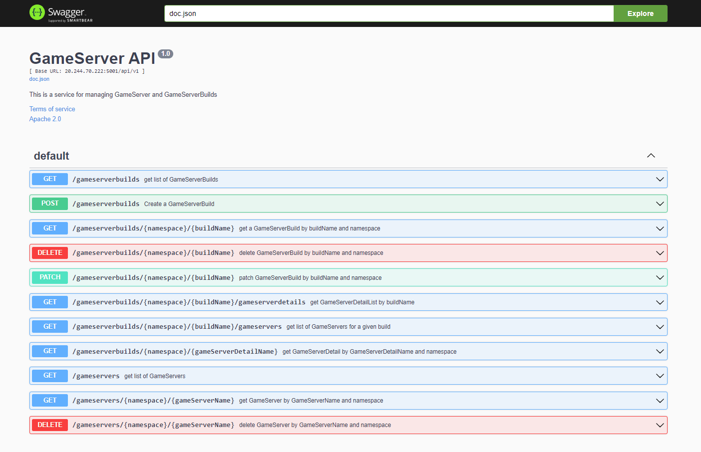

## Swagger for GameServer API

The API uses [swag](https://github.com/swaggo/swag) and [gin-swagger](https://github.com/swaggo/gin-swagger) packages from Swaggo to generate Restful API documentation with Swagger 2.0.

## How to use swag

Swag parses the API annotations to generate Swagger 2.0 documentation. Whenever there is a change in API annotations, we need to re-generate swagger docs using below command -


swag init -g cmd/gameserverapi/main.go --parseDependency


> **_NOTE_**: _--parseDependency_ is used to generate model definitions that inherit or depends on other type definitions. If the dependency depth is too high, use the _--parseDepth_ flag and set it to the required depth.

Swagger Host and BasePath are set automatically using gin context during CORSMiddleware injection. To change this behavior, please refer to the code below in [main.go](https://github.com/PlayFab/thundernetes/blob/main/cmd/gameserverapi/main.go)


func setSwaggerInfo(c *gin.Context) {
 // dynamically sets swagger host and base path
 docs.SwaggerInfo.Host = c.Request.Host
 docs.SwaggerInfo.BasePath = urlprefix
}


## Browse Swagger

Run the code and browse the following URL to use swagger -
<https://{$IP}:5001/swagger/index.html> or in case of localhost - <http://localhost:5001/swagger/index.html>

