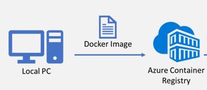

# How to run your game server on Thundernetes?

Once you [install Thundernetes](../quickstart/installing-thundernetes.md) (either on [kind](../quickstart/installing-kind.md) or [AKS](../quickstart/installing-aks.md)) and verify it's working as intended, you can prepare your game server for Thundernetes by integrating with the open source [Game Server SDK (GSDK)](https://github.com/playfab/gsdk). GSDK library is also used by [Azure PlayFab Multiplayer Servers (MPS)](https://docs.microsoft.com/gaming/playfab/features/multiplayer/servers/) service. In this way, you can easily migrate your game servers from MPS to Thundernetes and vice versa.

Integrating with GSDK is required for your game server to run on Thundernetes. Integration serves two purposes:

- allows your game server process to communicate its state to Thundernetes (Initializing, StandingBy, Terminated)
- allows Thundernetes to allocate your game server for a game session

To integrate with GSDK, follow the guide for the programming language/environment you are using.

- [Unity GSDK](unity.md)
- [Unreal GSDK](unreal.md)
- [C#/C++/Java/Go GSDK](csharpcppjava.md)

> **_NOTE_**: For experimenting with Thundernetes, you can use our [wrapper sample](../howtos/usingwrapper.md). This sample takes care of calling the GSDK for you and launching your game server as a separate process. Generally, not recommended for production workloads.

## Run your game server on Thundernetes

To run your game server on Thundernetes, you need to create a [GameServerBuild](../gameserverbuild.md).


apiVersion: mps.playfab.com/v1alpha1
kind: GameServerBuild
metadata:
  name: gameserverbuild-sample
spec:
  titleID: "1E03" # required
  buildID: "85ffe8da-c82f-4035-86c5-9d2b5f42d6f6" # must be a GUID
  standingBy: 2 # required
  max: 4 # required
  crashesToMarkUnhealthy: 5 # optional, recommended
  portsToExpose:
    - 80
  template:
    spec:
      containers:
        - image: &lt;containerRegistryUrl&gt;/&lt;containerImage&gt;:&lt;tag&gt;
          name: &lt;containerName&gt;
          ports:
          - containerPort: &lt;portName&gt; # your game server port
            protocol: &lt;TCP or UDP&gt; # your game server port protocol
            name: gameport # required field


You can call this file `gameserverbuild.yaml`.

- To configure this GameServerBuild to run on your cluster, you should run the following command:


kubectl apply -f /path/to/gameserverbuild.yaml


- Running `kubectl get gsb` and `kubectl get gs` should show something like this:


dgkanatsios@desktopdigkanat:digkanat$ kubectl get gsb
NAME                     STANDBY   ACTIVE   CRASHES   HEALTH
gameserverbuild-sample   2/2       0        0         Healthy
dgkanatsios@desktopdigkanat:digkanat$ kubectl get gs
NAME                           HEALTH    STATE        PUBLICIP     PORTS      SESSIONID
gameserverbuild-sample-rtgnm   Healthy   StandingBy   172.18.0.2   80:14913
gameserverbuild-sample-spdob   Healthy   StandingBy   172.18.0.2   80:14208


Congratulations, your game server is up and running on Thundernetes!

### Run your game server on Azure Kubernetes Service with Azure Container Registry

As soon as you build your container image, you should publish it to a container registry. If you are using Azure Kubernetes Service, we recommend publishing your image to [Azure Container Registry](https://docs.microsoft.com/azure/container-registry/). To integrate your Azure Container Registry with your Azure Kubernetes Service cluster, check the instructions [here](https://docs.microsoft.com/azure/aks/cluster-container-registry-integration).

