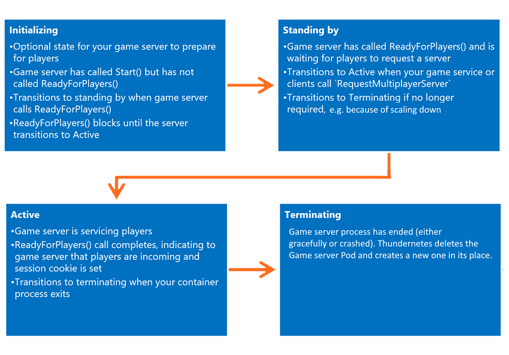

# Game Server lifecycle

This document contains information about GSDK and how it affects the game server lifecycle on Thundernetes.

## Game Server SDK (GSDK)

Game server lifecycle is dependent on the [GSDK](https://github.com/PlayFab/gsdk) calls as well as the state of the game server process. For more information on integrating your game server with GSDK, check the docs [here](https://docs.microsoft.com/gaming/playfab/features/multiplayer/servers/integrating-game-servers-with-gsdk).

Your game server can integrate GSDK and run on Thundernetes just by calling the **ReadyForPlayers** GSDK method. However, we recommend calling **Start** as well when your game server process starts so Thundernetes is aware that the game server is initializing.

## States of the game server

You can view the states of your GameServers by typing `kubectl get gs`. The states are:

- **Empty**: when the GameServer is created, the status is empty since we are waiting for the game server process to start and call the necessary GSDK methods.
- **Initializing**: GameServer transitions to this state when it calls the **Start()** GSDK method. In this state, the game server should be starting to load the necessary assets.
- **StandingBy**: GameServer transitions to this state when it calls the **ReadyForPlayers()** GSDK method. This state implies that the GameServer has loaded all the necessary assets and its ready for allocation.
- **Active**: GameServer transitions to this state when it is [allocated](../quickstart/allocation-scaling/md) by an external call to the allocation API service. Usually it's the responsibility of your matchmaker or lobby service to make this API call. This state implies that players can connect to the game server. When the server is in this state, it can never go back to the **Initializing** or **StandingBy** state.
- **Terminated**: GameServer process can reach this state by terminating, either gracefully or via a crash. Thundernetes monitors all containers in the Pod you specify and will consider a termination of any of them as the termination of the game server. This can happen at any GameServer state. When this happens, Thundernetes will remove the Pod running this GameServer and will create a new one in its place, which will start from the **Empty** state. 

GameServer Pods in the Initializing or StandingBy state can be taken down during a cluster scale-down. Thundernetes makes every effort to prevent Active GameServer Pods from being taken down, since this would have the undesirable effect of breaking an existing game. Moreover, as mentioned, GameServer can never transition back to StandingBy state from Active state. The only way to get a new game server in StandingBy state is if the GameServer process exits. You should gracefully exit your game server process when the game session is done and the last connected player has exited the game.

> _**NOTE**_: If the game server process crashes for more than `crashesToMarkUnhealthy` times (specified in the GameServerBuild spec, default value 5), then no more operations will be performed on the GameServerBuild. 

> _**NOTE**_: User is responsible for collecting logs while the Pod is running. Check [here](../howtos/gameserverlogs.md) on how to do this.

## Verifying GSDK integration with your game server

You can use the open source tool **LocalMultiplayerAgent** to test GSDK integration and maybe test the game server in your local environment. You can download it [here](https://github.com/PlayFab/MpsAgent) and you can check the docs [here](../howtos/runlocalmultiplayeragent.md) for more information.

## GSDK samples

To check GSDK samples demonstrating integration with popular game engines, you can check the MpsSamples repository [here](https://github.com/PlayFab/MpsSamples).