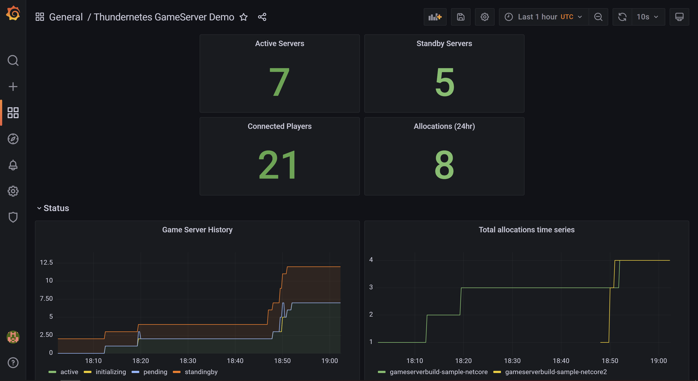

# Monitoring

Thundernetes is able to export game server related metrics to a [Prometheus](https://prometheus.io/docs/introduction/overview/) server, and these can also be imported
to a [Grafana](https://grafana.com/docs/grafana/latest/introduction/) server for easy and intuitive visualizations.

Prometheus uses a pull model to retrieve data, and needs apps to implement an endpoint that responds to its HTTP requests. For this, Thundernetes exposes the following endpoints:

* **{controller manager service IP}:8080/metrics**
* **{nodeagent service IP}:56001/metrics**

## Install Thundernetes with Prometheus and Grafana

While it's possible to create and manage your own Prometheus and Grafana instances to consume the endpoints described above, it is also possible to install both into your K8s cluster using very few steps thanks to the [kube-prometheus](https://github.com/prometheus-operator/kube-prometheus) project. This will install the prometheus-operator and Grafana, and will connect them automatically. For this, follow these steps:


# clone the kube-prometheus repository
git clone https://github.com/prometheus-operator/kube-prometheus.git

cd kube-prometheus/

# install kube-prometheus' CRDs
kubectl create -f manifests/setup
until kubectl get servicemonitors --all-namespaces ; do date; sleep 1; echo ""; done
kubectl create -f manifests/


> **_NOTE_**: You can also check the [official Prometheus Operator docs](https://prometheus-operator.dev/)

After this, you can install Thundernetes using the install files "with monitoring", these automatically create Prometheus ServiceMonitors that crawl the endpoints described above.


kubectl apply -f https://raw.githubusercontent.com/PlayFab/thundernetes/main/installfiles/operator_with_monitoring.yaml


## Check the data in Prometheus and Grafana

To test this, you can install the netcore Game Server Build sample, this is a basic application that uses GSDK to send information to Thundernetes. You should also allocate a server so you can see the data.


kubectl apply -f https://raw.githubusercontent.com/PlayFab/thundernetes/main/samples/netcore/sample-requestslimits.yaml

This will create a Game Server Build with 2 standby Game Servers, you can check they were successfully created like this:


# check the build
kubectl get gsb

# check the servers
kubectl get gs

 To allocate a server, you need to have access to the thundernetes-controller-manager IP, in an AKS cluster you can get that like this:
 
 export IP=$(kubectl get svc -n thundernetes-system thundernetes-controller-manager -o jsonpath='{.status.loadBalancer.ingress[0].ip}')
 

 Then allocate the server. The buildId must be the same than the one in the YAML file of the netcore sample, and the sessionId is used to identify the session:
 
curl -H 'Content-Type: application/json' -d '{"buildID":"85ffe8da-c82f-4035-86c5-9d2b5f42d6f6","sessionID":"ac1b7082-d811-47a7-89ae-fe1a9c48a6da"}' http://${IP}:5000/api/v1/allocate
 

You can check the data exported in Prometheus, to access the Prometheus instance in your cluster use  port forwarding and open localhost:9090 in your browser:

kubectl --namespace monitoring port-forward svc/prometheus-k8s 9090


You can check the same data in Grafana and create a custom dashboard, to access the Grafana instance in your cluster use port forwarding and open localhost:3000 in your browser:

kubectl --namespace monitoring port-forward svc/grafana 3000

There is a custom Grafana dashboard example that visualizes some of this data in the [samples/grafana](https://github.com/PlayFab/thundernetes/tree/main/samples/grafana) directory.

## List of exported Prometheus metrics

| Metric name | Metric type | Source |
| --- | --- | --- |
| gameserver_states | Gauge | nodeagent |
| connected_players | Gauge | nodeagent |
| gameservers_current_state_per_build | Gauge | controller-manager |
| gameservers_created_total | Counter | controller-manager |
| gameservers_sessionended_total | Counter | controller-manager |
| gameservers_crashed_total | Counter | controller-manager |
| gameservers_deleted_total | Counter | controller-manager |
| allocations_total | Counter | controller-manager |

## More pictures

