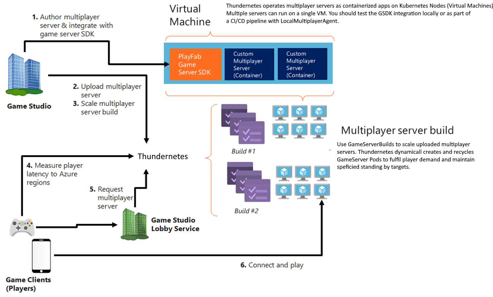

# Allocate a game server

Allocating a GameServer will transition its state from "StandingBy" to "Active" and will unblock the "ReadyForPlayers" GSDK call. You can read [the gameserver lifecycle document](../gsdk/gameserverlifecycle.md) to learn more about the lifecycle of a GameServer.

If you are running Thundernetes on a cloud service like Azure Kubernetes Service, you can use the following commands to allocate a game server (below is using [Windows Subsystem for Linux](https://docs.microsoft.com/windows/wsl/install)


# grab the IP of the external load balancer that is used to route traffic to the allocation API service
IP=$(kubectl get svc -n thundernetes-system thundernetes-controller-manager -o jsonpath='{.status.loadBalancer.ingress[0].ip}')
# do the allocation call. Make sure the buildID is the same as the one that you created your Build with
# the sessionID is a unique identifier (GUID) that you can use to track the game server session
curl -H 'Content-Type: application/json' -d '{"buildID":"85ffe8da-c82f-4035-86c5-9d2b5f42d6f6","sessionID":"ac1b7082-d811-47a7-89ae-fe1a9c48a6da"}' http://${IP}:5000/api/v1/allocate


If you are running Thundernetes on [kind](installing-kind.md) your IP can be replaced with localhost and you only need to run the following:


curl -H 'Content-Type: application/json' -d '{"buildID":"85ffe8da-c82f-4035-86c5-9d2b5f42d6f6","sessionID":"ac1b7082-d811-47a7-89ae-fe1a9c48a6da"}' http://localhost:5000/api/v1/allocate


The arguments to the allocation call are two:

* buildID (required): this must be the same as the buildID configured in the GameServerBuild
* sessionID (required): a GUID that you can use to identify the game server session. Must be unique for each game server you allocate. If you try to allocate using a sessionID that is in use, the call will return the details of the existing game server. 
* sessionCookie (optional): an optional string that contains information that is passed to the game server. Retrievable by GSDK
* initialPlayers (optional): an optional array of strings containing the user IDs of the players that are expected to connect initially to the server. Retrievable by GSDK

Result of the allocate call is the IP/Port of the server in JSON format.


{"IPV4Address":"52.183.89.4","Ports":"80:10000","SessionID":"ac1b7082-d811-47a7-89ae-fe1a9c48a6da"}


You can now use the IP/Port to connect to the allocated game server. The [.NET Core game server](sample-dotnet.md) we use exposes a `/Hello` endpoint that returns the hostname of the container.


curl http://52.183.89.4:10000/Hello
Hello from fake GameServer with hostname gameserverbuild-sample-netcore-mveex


At the same time, you can check your game servers using `kubectl get gs`. Our sample games request 2 standingBy and 4 maximum servers. The allocation call caused one StandingBy server to transition to Active. So, Thundernetes created an extra GameServer, which eventually reached the StandingBy state. We can now see that we have 2 StandingBy and 1 Active. We can also see the SessionID of the Active GameServer.


NAME                                   HEALTH    STATE        PUBLICIP      PORTS      SESSIONID
gameserverbuild-sample-netcore-ayxzh   Healthy   StandingBy   52.183.89.4   80:10001
gameserverbuild-sample-netcore-mveex   Healthy   Active       52.183.89.4   80:10000   ac1b7082-d811-47a7-89ae-fe1a9c48a6da
gameserverbuild-sample-netcore-pxrqx   Healthy   StandingBy   52.183.89.4   80:10002


### Lifecycle of a game server

The game server will remain in Active state as long as the game server process is running. Once the game server process exits, the GameServer Custom Resource will be deleted. This will make the game server pod to be deleted and a new one will be created in its place (provided we are not beyond the GameServerBuild's maximum). For more information on the GameServer lifecycle, please check [here](../gsdk/gameserverlifecycle.md).

# Scaling a GameServerBuild

There are two properties that determine the number of game servers that will be created in a GameServerBuild. 
- the standingBy number is the number that defines the number of servers that we want to have in the standingBy state.
- the max number is the total number of servers that we want to have in this GameServerBuild. The count of Initializing+StandingBy+Active servers will never be more than the max for a given GameServerBuild.

To modify the StandingBy and Max numbers, you can use `kubectl edit gsb <name-of-gameserverbuild>`. Thundernetes also supports the `kubectl scale gsb <name-of-gameserverbuild> --replicas=X` to set the standingBy number for a GameServerBuild.
