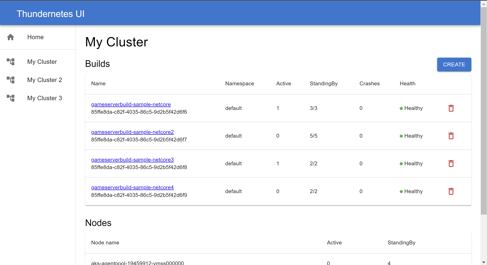

# Thundernetes UI

Currently we are developing [Thundernetes UI](https://github.com/PlayFab/thundernetes-ui), a front end application to manage game servers running in one or more Thundernetes clusters. To be able to connect to them, be sure to deploy the [GameServer API](https://github.com/PlayFab/thundernetes/tree/main/cmd/gameserverapi) on each cluster.

## Check all of your clusters in the same place

You can see a summary of what's going on in all your clusters.

## Manage the builds on each cluster

Check the builds you have on each cluster and their current status. You can also create a new one, either from scratch, or by cloning one from any cluster!

## Manage each build

You can check each build separately and see it's status and specs, you can modify the standingBy and max values, allocate individual game servers for testing, and see a list of all the game servers running.

