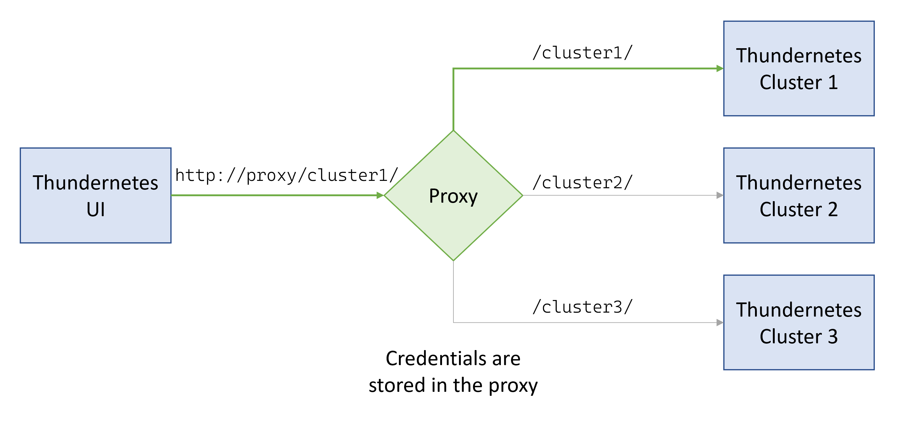

# How to authenticate to an API

Kubernetes allows you to secure the Thundernetes' GameServer API [using an Ingress](https://playfab.github.io/thundernetes/howtos/serviceingress.html), if you do this you will need a way to provide the certificates from this client. Currently the [Thundernetes UI](https://github.com/PlayFab/thundernetes-ui) is conceived as a simple React application, and because of this it's not safe to store credentials in the app. A very easy to implement alternative is to use a proxy that contains the credentials, in the following sections we show an example for deploying a reverse proxy using the official [Nginx Docker image](https://hub.docker.com/_/nginx).

## Architecture

The idea is to use a proxy between the UI and Thunernetes' API, so the UI makes the requests to the proxy, and the proxy to the Thundernetes clusters, this way the credential can be stored in the proxy without them being exposed through the browser. You can also use a single proxy for multiple clusters, using Nginx to act as a reverse proxy.

## How to configure your own proxy with mTLS

All we need to do is to write a configuration file for Nginx and a Dockerfile to create a container with the credentials. Lets create a configuration file called `default.conf` and add the following:


server{
  listen 80;

  location /tls/ {
    proxy_pass                    https://{your_endpoint_with_mTLS}/;
    proxy_ssl_certificate         /etc/ssl/private/client.crt;
    proxy_ssl_certificate_key     /etc/ssl/private/client.key;
    proxy_ssl_trusted_certificate /etc/ssl/private/ca.crt;
    proxy_ssl_verify              on;
  }

}


This file uses `proxy_pass` to define that every request to `http://{proxy_ip}/tls/` will be forwarded to `https://{your_endpoint_with_mTLS}/`, the trailing forward slashes are necessary so the rest of the URI is forwarded too. It also defines the key pair that the client, this proxy, uses to authenticate, for this `proxy_ssl_certificate` and `proxy_ssl_certificate_key` are used. Finally, you use `proxy_ssl_trusted_certificate` to define a trusted Certificate Authority (CA), so every certificate signed with that will be trusted, and also `proxy_ssl_verify` to toggle the validation for the certificates that come from the server.

Now create a Dockerfile with the following, be sure to have the files you need in the same directory:


FROM nginx:1.23-alpine
RUN rm /etc/nginx/conf.d/default.conf
COPY default.conf /etc/nginx/conf.d/
COPY client.crt /etc/ssl/private/
COPY client.key /etc/ssl/private/
COPY ca.crt /etc/ssl/private/
EXPOSE 80
CMD ["nginx", "-g", "daemon off;"]


In this you pull the Nginx Docker image, add the configuration, and the certificates. Now you can build the image:


docker build -t nginx-proxy:0.1 .


And run it:


docker run -d -p 80:80 nginx-proxy:0.1


## Connect Thundernetes UI to the proxy

Simply add the proxy IP, with the correct URI, to the config file before starting the UI:


var clusters = {
  "with_tls": {
    "api": "http://{proxy_IP}/api/v1/",
    "allocate": "http://{allocate_api}:5000/api/v1/allocate",
  }
}


> **_NOTE_**: This tutorial only shows how to connect to the GameServer API with mTLS, but the steps are exactly the same if you added mTLS to the allocate endpoint.

## Other authentication methods

Nginx also allows you to add headers using the `proxy_set_header` directive, so any other type of authentication that uses headers to send credentials are easily supported by this method. 
