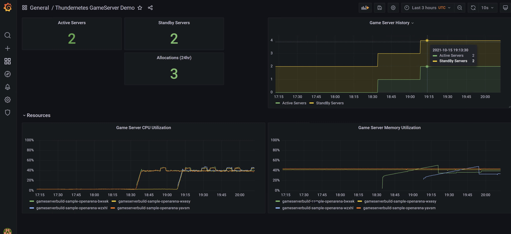

# Sample Grafana Dashboard

The `dashboard.json` file in this folder can be imported to grafana to provide a simple example of retrieving metrics from the Thundernetes Controller. It makes the assumption that the Prometheus data source is named `Prometheus`, so you may need to edit the json file before importing if your Grafana installation uses a different name.
